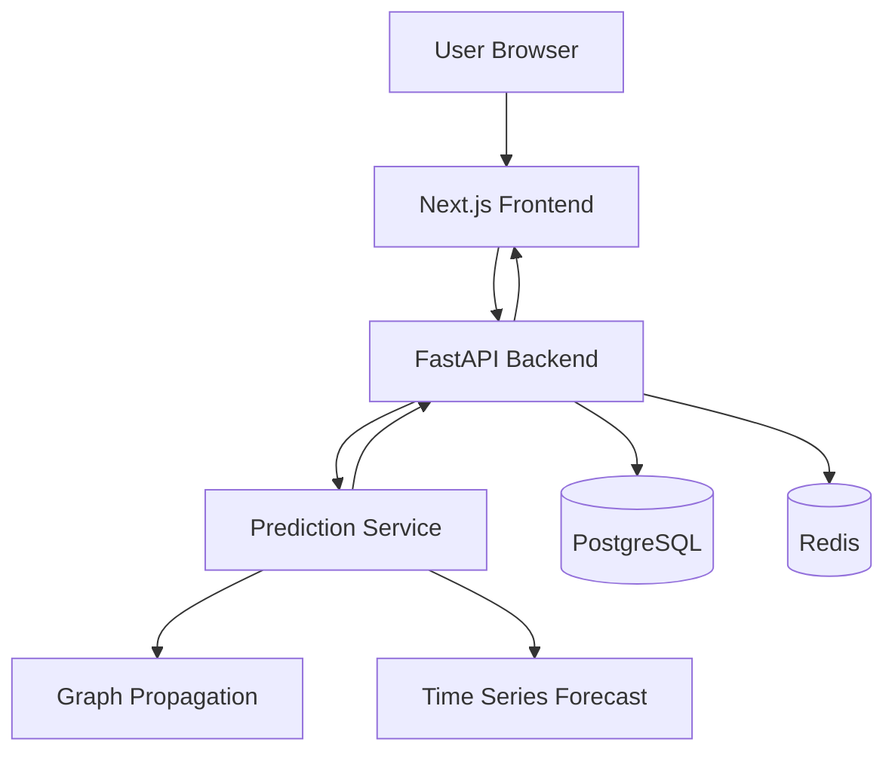
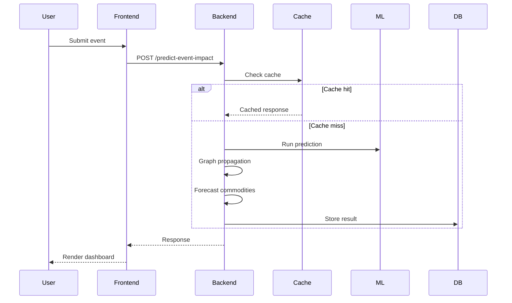
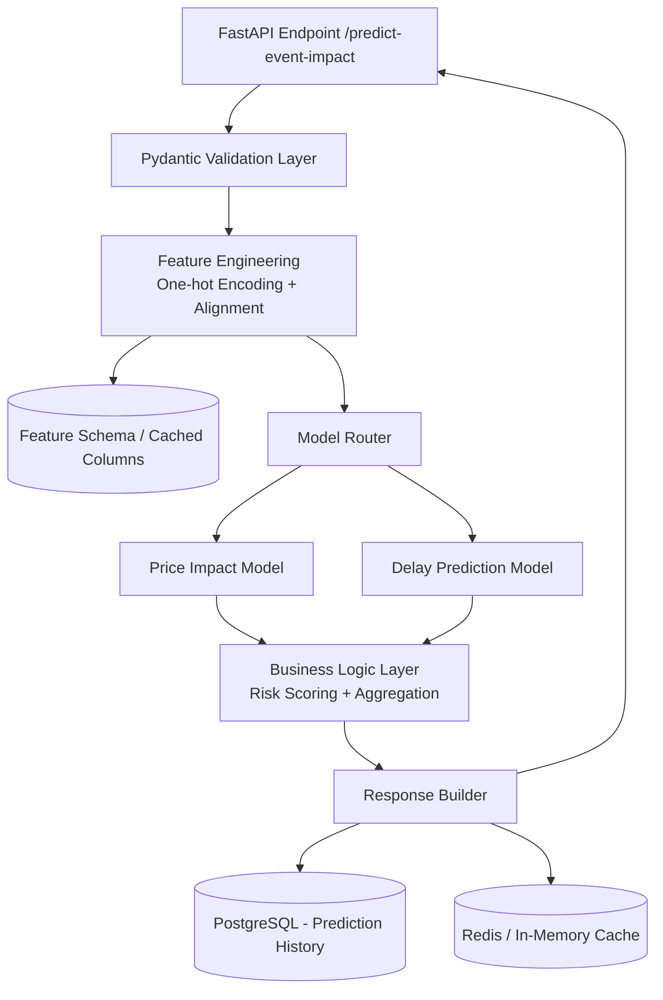

# Geoflation

Geoflation is an end-to-end geopolitical trade shock prediction platform with a dashboard frontend and a FastAPI backend.

It analyzes geopolitical events (sanctions, wars, tariffs, etc.) and predicts their impact on global trade flows, supply chains, and commodity markets.

---

## What this project does

* Input a geopolitical event from the web dashboard
* Run impact prediction using ML + rule-based fallback
* Simulate trade shock propagation across countries
* Forecast commodity price movements
* Estimate shipping delays and risk severity
* Store predictions in a database
* Display results and history in a dashboard

---

## Architecture



---

## Runtime request flow



---

## Internal Pipeline Architecture



--- 

## Tech stack

### Frontend

* Next.js
* TailwindCSS
* Recharts

### Backend

* FastAPI
* Python 3.11
* Uvicorn
* SQLAlchemy

### Machine Learning

* Scikit-learn
* Prophet
* NetworkX

### Infrastructure

* Docker
* PostgreSQL
* Redis

---

## Repository structure

```
geoflation/
├── backend/
│   ├── main.py
│   ├── api/
│   ├── ml_models/
│   ├── services/
│   ├── data_pipeline/
│   ├── models/
│   ├── utils/
│   └── config.py
├── frontend/
│   ├── app/
│   ├── components/
│   └── styles/
├── data/
├── docker-compose.yml
├── Dockerfile
├── requirements.txt
└── README.md
```

---

## API overview

### GET /health

Returns backend health status.

### POST /predict-event-impact

Input:

```json
{
  "event_type": "sanction",
  "country": "Iran",
  "sector": "oil",
  "severity": 0.8
}
```

Output:

```json
{
  "price_impacts": {"oil": "14%", "gas": "9%"},
  "shipping_delay_weeks": 2,
  "affected_countries": ["iran", "china"],
  "affected_industries": ["energy"],
  "risk_severity": "High",
  "explanation": "..."
}
```

### GET /commodity-trends

Returns time-series forecast data.

### GET /trade-network

Returns trade graph data.

### GET /prediction-history

Returns stored prediction history.

---

## Local development

### 1) Full stack (Docker)

```bash
docker-compose up --build
```

Frontend: [http://localhost:3000](http://localhost:3000)
Backend: [http://localhost:8000/docs](http://localhost:8000/docs)

---

### 2) Backend (manual)

```bash
python -m venv venv
source venv/bin/activate  # or Windows equivalent
pip install -r requirements.txt
uvicorn backend.main:app --reload
```

---

### 3) Frontend (manual)

```bash
cd frontend
npm install
npm run dev
```

---

## Deployment

The system is fully containerized using Docker.

* Backend runs via Uvicorn inside container
* Frontend runs as a Next.js production build
* PostgreSQL handles persistence
* Redis handles caching

The project can be deployed to platforms like Railway, AWS, or GCP.

---

## Core components

### Prediction service

Handles event → impact prediction using ML models.

### Graph propagation

Simulates how shocks spread across trade networks.

### Forecasting

Generates commodity trends using time-series models.

### Persistence layer

Stores prediction history in PostgreSQL.

### Caching layer

Uses Redis to cache expensive computations.

---

## Future work

* Replace synthetic data with real datasets
* Add authentication (JWT)
* Deploy to cloud infrastructure
* Implement Graph Neural Networks (PyTorch Geometric)
* Add LLM-based explanation layer

---

## License

MIT License
