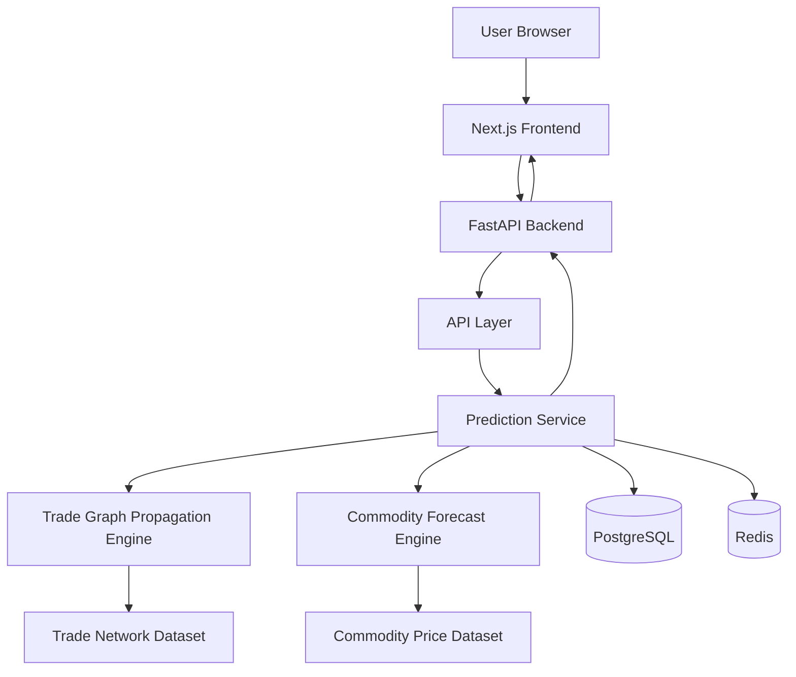
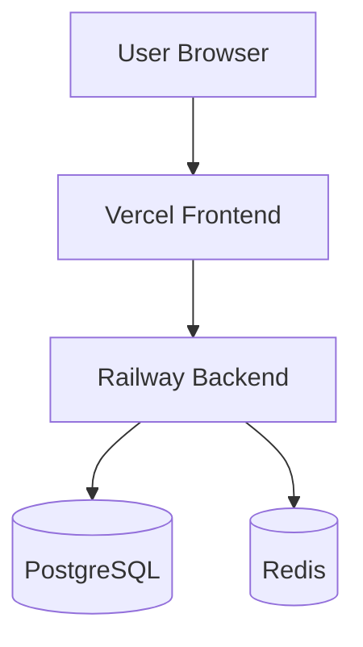
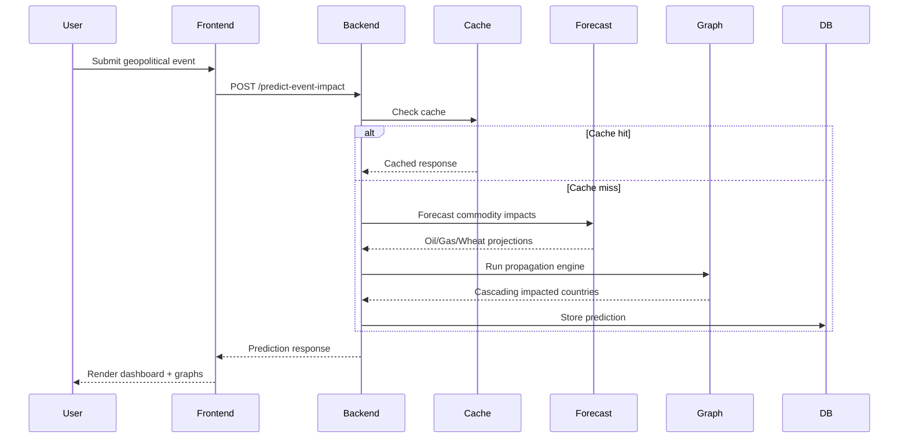
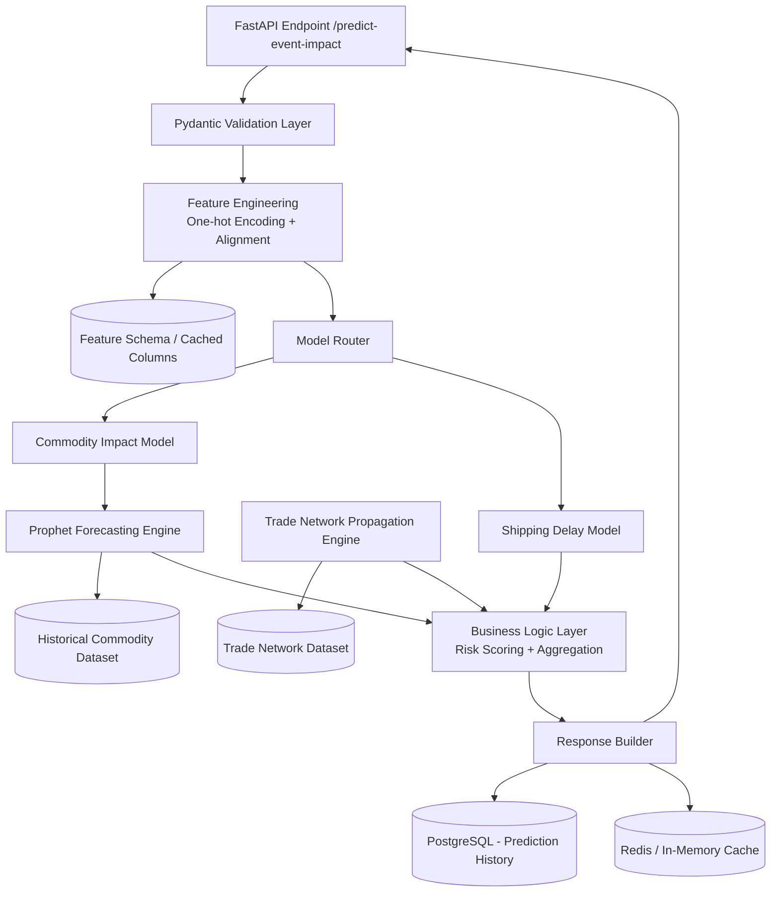

# Geoflation

Geoflation is an end-to-end geopolitical trade shock prediction platform with a dashboard frontend and a FastAPI backend.

It analyzes geopolitical events (sanctions, wars, tariffs, embargoes, naval blockades, port disruptions, etc.) and predicts their impact on global trade flows, supply chains, shipping networks, and commodity markets.

The platform combines:
- real commodity forecasting
- trade network graph propagation
- ML-driven prediction pipelines
- geopolitical risk simulation
- production-grade infrastructure

---

## Version

Current version: v1.1.0

---

## Live Demo

Frontend: https://geoflation.vercel.app

Backend API Docs: https://geoflation-production.up.railway.app/docs

---

## What this project does

- Input a geopolitical event from the web dashboard
- Run event impact prediction using ML + rule-based fallback
- Forecast commodity price disruptions using real historical datasets
- Simulate weighted trade shock propagation across countries
- Model cascading multi-hop geopolitical disruptions
- Estimate shipping delays and risk severity
- Store predictions in PostgreSQL
- Cache expensive computations with Redis
- Display forecasts, trade graphs, and prediction history in a dashboard

---

## Architecture



---

## Deployment Architecture



---

## Runtime Request Flow



---

## Internal Pipeline Architecture



---

## Tech Stack

### Frontend

- Next.js
- TailwindCSS
- Recharts

### Backend

- FastAPI
- Python 3.11
- Uvicorn
- SQLAlchemy

### Machine Learning & Analytics

- Scikit-learn
- Prophet
- NetworkX
- Pandas
- NumPy

### Infrastructure

- Docker
- PostgreSQL
- Redis
- Railway
- Vercel

---

## Repository Structure

```text
geoflation/
├── backend/
│   ├── main.py
│   ├── api/
│   ├── ml_models/
│   │   ├── price_forecast.py
│   │   ├── trade_propagation.py
│   │   └── model_loader.py
│   ├── services/
│   ├── data_pipeline/
│   │   ├── preprocess_commodity_data.py
│   │   └── load_trade_network.py
│   ├── models/
│   ├── utils/
│   └── config.py
│
├── frontend/
│   ├── app/
│   ├── components/
│   └── styles/
│
├── data/
│   ├── raw/
│   │   ├── commodities/
|   |       └──commodity_prices_processed.csv
│   │   └── trade/
|   |       └──trade_edges.csv 
│   └── processed/
│
├── docker-compose.yml
├── Dockerfile
├── requirements.txt
└── README.md
```

---

## API Overview

### GET /health

Returns backend health status.

---

### POST /predict-event-impact

Input:

```json
{
  "event_type": "war",
  "country": "Russia",
  "sector": "energy",
  "severity": 0.9
}
```

Output:

```json
{
  "price_impacts": {
    "oil": "17.41%",
    "gas": "13.07%"
  },
  "shipping_delay_weeks": 2,
  "impacted_countries": {
    "China": 0.72,
    "EU": 0.63,
    "USA": 0.48
  },
  "affected_industries": [
    "energy"
  ],
  "risk_severity": "High",
  "explanation": "..."
}
```

---

### GET /commodity-trends

Returns Prophet-generated commodity forecasting data using historical datasets.

---

### GET /trade-network

Returns weighted trade graph data used for geopolitical propagation.

---

### GET /prediction-history

Returns stored historical predictions from PostgreSQL.

---

## Real Data Sources

### Commodity Price Data

Source:
World Bank Pink Sheet Dataset

Integrated:
- crude oil
- natural gas
- wheat

Dataset frequency:
- monthly historical data
- 1960 → present

---

### Trade Network Data

Current version uses:
- curated weighted trade relationships
- NetworkX directed graph modeling

Foundation prepared for:
- UN Comtrade integration
- large-scale graph ingestion
- Graph Neural Networks

---

## Local Development

### 1) Full Stack (Docker)

```bash
docker-compose up --build
```

Frontend:
http://localhost:3000

Backend:
http://localhost:8000/docs

---

### 2) Backend (Manual)

```bash
python -m venv venv

# Windows
venv\Scripts\activate

# Linux / macOS
source venv/bin/activate

pip install -r requirements.txt

uvicorn backend.main:app --reload
```

---

### 3) Frontend (Manual)

```bash
cd frontend

npm install

npm run dev
```

---

## Deployment

| Service | Platform |
|---|---|
| Frontend | Vercel |
| Backend | Railway |
| Database | PostgreSQL (Railway) |
| Cache | Redis (Railway) |

---

## Core Components

### Prediction Service

Handles geopolitical event → disruption prediction using ML models.

---

### Trade Graph Propagation Engine

Simulates weighted cascading trade disruptions across global trade networks.

Supports:
- multi-hop propagation
- severity decay
- graph traversal

---

### Commodity Forecasting Engine

Uses Prophet-based time-series forecasting on real historical commodity datasets.

Forecasted commodities:
- oil
- gas
- wheat

---

### Persistence Layer

Stores prediction history in PostgreSQL.

---

### Caching Layer

Uses Redis to cache:
- commodity forecasts
- trade network responses
- expensive graph computations

---

## Future Work

- Full UN Comtrade ingestion pipeline
- Graph centrality scoring
- Country vulnerability indices
- JWT authentication
- Graph Neural Networks (PyTorch Geometric)
- LLM-based strategic explanation layer
- Probabilistic geopolitical forecasting
- Maritime chokepoint disruption modeling

---

## License

MIT License
